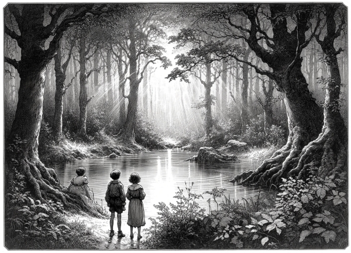

# Källan: from Swedish novel to English audiobook

_It is a source within us, Felix. An invisible source — a source that is very difficult to access. It is so close but yet so far away, so far away but yet so close. It requires so much of us before it reveals itself. And once we have found it, we can lose it again. And then it's just as difficult to find it again. Once when I was young, I found it — but don't ask me how I found it; I don't know, maybe it was just a grace granted to me. I'm looking for it again; I'm always looking for it. Sometimes I feel that I'm so close to it that I expect to see it in the next moment, but the next day it's just as far away as before._

## Details
This project focuses on turning a Swedish book, previously untranslated into any other language, into an English audiobook. This book was written by Walter Ljungquist in 1961 and served as inspiration for Anna Von Hausswolff, a musician I like. Since I don't understand Swedish, I've always wondered what was the novel about. Now, thanks to AI, I can finally unveil its story. 

The process begins by translating the book into English using an OpenAI GPT model. Subsequently, a Text-To-Speech (TTS) model, also from OpenAI, is employed to convert the translated text into an audio format.

Scripts:
- `src/processing.py`: processes the PDF text by dividing it in chapters and chunks fit for the models.
- `src/translate.py`: translates the processed text into English.
- `src/text_to_speech.py`: synthetizes audio tracks from the translated text.
- `src/merge_tracks.py`: merges all the audio tracks in a unique MP3 file.

## Links
The audiobook can be listened to [here](https://www.youtube.com/channel/UCLI7IQrRzLPbHAJDuVt0lgA).